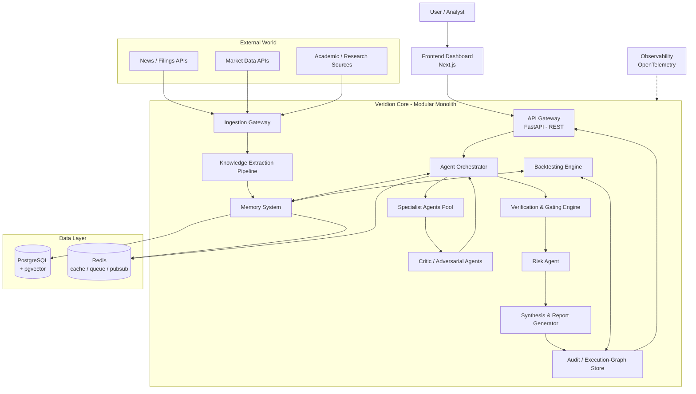
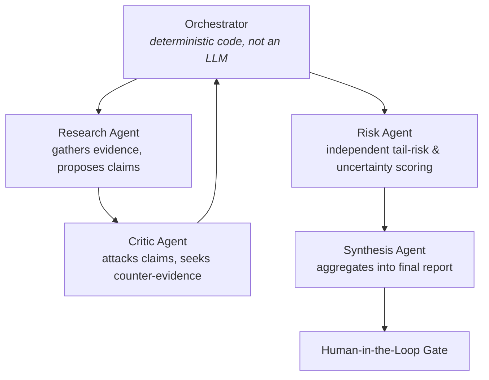
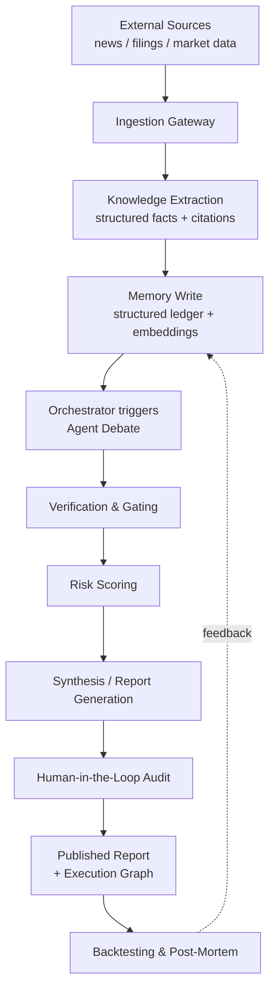

# Veridion Architecture Design Document

### ADR-0001 — Founding Engineering Architecture

|                   |                                                                                                  |
| ----------------- | ------------------------------------------------------------------------------------------------ |
| **Status**  | Proposed                                                                                         |
| **Author**  | CTO / Principal Software Architect (founding technical co-founder)                               |
| **Date**    | 2026-06-28                                                                                       |
| **Inputs**  | `vision.md`, Research Report #1 — "How World-Class Investment Firms Think"                    |
| **Team**    | Single developer + AI assistance                                                                 |
| **Horizon** | This document governs years 1–3 (MVP → Growth) and sets the migration path to Production Scale |

> This is not a request for an impressive system. It is a request for a system one engineer can actually finish, that does not have to be rewritten when it succeeds. Every recommendation below is filtered through that lens first, and through the vision's principles (radical traceability, strict decoupling, calibrated uncertainty, deterministic replayability) second. Where the two are in tension, this document says so explicitly rather than hiding it.

---

## 1. Overall Philosophy

**Decision: Modular Monolith — deployed as one process, structured as if it were already several services.**

Three options were on the table:

- **Pure monolith** (one undifferentiated codebase, modules call each other freely) — fastest to start, but it directly violates the vision's "Strict Decoupling" principle (§14: *"Ingestion, cognition, validation, and action layers must remain strictly isolated"*). Without enforced boundaries, a solo project under time pressure *will* let the research agent reach into the database layer directly, and three months later nothing can be tested or replaced in isolation.
- **Microservices** — theoretically the "correct" architecture for a system that will eventually need independent scaling of ingestion vs. agent compute vs. memory. In practice, for a single developer, this means owning service discovery, distributed tracing, network failure handling, N deployment pipelines, and N sets of infrastructure config before a single feature ships. The operational tax is paid every day; the scaling benefit is paid years from now, if ever. This is the most common way solo/early-stage technical founders burn their runway on infrastructure instead of the product.
- **Modular Monolith** — one deployable artifact, but internally organized into packages with explicit public interfaces (`packages/ingestion`, `packages/agents`, `packages/memory`, etc., detailed in §9). Modules communicate through defined contracts — direct function calls for synchronous needs, an internal event emitter for async/fan-out needs — never by reaching into each other's internals or shared global state.

**Why this satisfies both constraints at once:** the module boundary *is* the future service boundary. When (not if) a specific module becomes a genuine bottleneck — say, ingestion needs independent scaling because you're polling 50 data sources, or agent debate workloads need GPU/compute isolation — that module is extracted behind the same interface it already had. The application code that calls it doesn't change, only the transport underneath (in-process call → network call). This is the standard "modular monolith → selectively extracted services" path, and it avoids the two failure modes on either side: rewriting everything later, or drowning in distributed-systems overhead now.

**Rule going forward:** if you ever catch yourself importing something from `packages/agents/internal/*` into `packages/ingestion`, that's the boundary breaking. The fix is always "expose a proper interface," never "just import it, it's faster."

---

## 2. High-Level Architecture



Notes on this diagram:

- **Everything inside the dashed `CORE` boundary ships as one deployable in the MVP.** The internal arrows are the module contracts described in §1 and §9 — they exist whether or not the modules are ever physically split.
- **The Critic loop is drawn explicitly** because it's the mechanism that fulfils the vision's "Constructive Disagreement" principle (§7) — it is not optional plumbing, it's a first-class architectural feature.
- **Observability wraps everything** rather than sitting beside it, because the vision treats traceability and failure-as-telemetry as non-negotiable (§16), not as an afterthought bolted on near production.

---

## 3. Core Modules

Each module below is described by Purpose, Responsibilities, Inputs, Outputs, Dependencies, Failure Modes, and Future Expansion. These map directly to the `packages/` in §9.

### 3.1 Ingestion Gateway

- **Purpose:** The single, controlled doorway between the outside world and Veridion. Nothing downstream talks to an external API directly.
- **Responsibilities:** Polling/streaming connectors per source type (filings, news, market data); rate-limiting and retry/backoff; raw payload persistence before any transformation (so a bad parser never destroys source-of-truth data).
- **Inputs:** External APIs, RSS/webhooks, scheduled pulls.
- **Outputs:** Raw, timestamped, source-attributed records written to a `raw_documents` table.
- **Dependencies:** PostgreSQL (raw storage), external API credentials/config.
- **Failure modes:** Source API downtime or schema change; rate-limit exhaustion; duplicate ingestion. Mitigation: idempotent writes keyed on `(source, source_id)`, circuit breakers per connector.
- **Future expansion:** Each connector becomes independently scalable/extractable once polling volume justifies it (growth stage).

### 3.2 Knowledge Extraction Pipeline

- **Purpose:** Turn raw, unstructured source material into structured, citable claims and entities.
- **Responsibilities:** Parsing (HTML/PDF/XBRL), entity recognition, claim/fact extraction, source-span citation tagging (every extracted fact must keep a pointer back to the exact source passage — this *is* the Radical Traceability requirement at the data layer).
- **Inputs:** `raw_documents`.
- **Outputs:** Structured `extracted_facts` rows + embeddings for semantic memory.
- **Dependencies:** Ingestion Gateway, Memory System.
- **Failure modes:** Mis-extraction/hallucinated structure from an LLM-assisted parser. Mitigation: every extraction passes a deterministic schema validator (Verification Engine) before being marked "trusted."
- **Future expansion:** Domain-specific extractors (XBRL-aware financial statement parser, transcript parser) added incrementally, only when a real document type demands it.

### 3.3 Memory System

- **Purpose:** The shared, structured substrate all agents read from and write to — deliberately *not* private per-agent memory, so reasoning stays auditable.
- **Responsibilities:** Three tiers — **Working memory** (ephemeral, per-task, Redis) for in-flight debate state; **Semantic memory** (pgvector embeddings) for "have we seen something like this before"; **Structured ledger** (Postgres tables: claims, evidence, confidence history, outcomes) as the system of record for backtesting and the Traceability Index.
- **Inputs:** Extraction Pipeline output, Agent outputs, Backtest outcomes.
- **Outputs:** Retrieval results to Orchestrator/Agents; historical data to Backtesting Engine.
- **Dependencies:** PostgreSQL, Redis.
- **Failure modes:** Stale working memory leaking between tasks (mitigated by task-scoped Redis key namespaces with TTLs); semantic drift in embeddings over time (mitigated by re-embedding on model upgrade, versioned embedding columns).
- **Future expansion:** Split semantic memory into a dedicated vector DB (§6) once embedding volume outgrows pgvector.

### 3.4 Agent Orchestrator

- **Purpose:** The deterministic "conductor" — explicitly **not an LLM agent itself.** It is plain code that sequences agent calls, enforces the debate protocol, and is the only thing every agent message passes through. This is what keeps the system replayable and auditable.
- **Responsibilities:** Task scheduling, message routing between agents using typed schemas, enforcing max-round limits on debate, invoking the Verification Gate between every agent step.
- **Inputs:** A research task/hypothesis (from API or scheduled trigger).
- **Outputs:** A complete, ordered execution graph (every message, every gate result) for a given task.
- **Dependencies:** Memory System, Specialist Agents, Verification Engine.
- **Failure modes:** Infinite debate loops (hard round cap + convergence check), agent timeout/non-response (fallback to "insufficient evidence, flag for human review" rather than silently failing).
- **Future expansion:** Becomes the natural seam for distributed execution (e.g., farming agent calls to worker processes) without changing its external contract.

### 3.5 Specialist Agents Pool

- **Purpose:** Narrow, single-responsibility reasoning units (per vision §9, "Single-Responsibility Agents").
- **Responsibilities:** MVP set is deliberately small — see §4 for the justification of exactly which agents exist and why.
- **Inputs:** Task context + relevant memory retrieval, delivered by the Orchestrator.
- **Outputs:** Typed `Claim` objects with attached `Evidence` references and a self-reported confidence.
- **Dependencies:** LLM provider(s), Memory System (read-only retrieval — agents never write directly to the ledger; only the Orchestrator commits to memory after verification).
- **Failure modes:** Hallucinated evidence (caught by the Verification Engine, which checks every cited source actually exists and says what's claimed); low-confidence outputs (routed to human review per the Calibration Service threshold).
- **Future expansion:** New domain specialists (macro, forensic accounting, policy) added only when a generalist agent demonstrably underperforms in that domain — never speculatively.

### 3.6 Critic / Adversarial Validation Layer

- **Purpose:** Operationalizes "Constructive Disagreement" (vision §7) and "Adversarial Validation" (vision §9) as an architectural component, not a prompt-engineering afterthought.
- **Responsibilities:** Reviews claims from Specialist Agents, attempts to find counter-evidence, flags unsupported logical leaps, scores the claim's defensibility.
- **Inputs:** Claims + Evidence from Specialist Agents.
- **Outputs:** `Critique` objects (per-claim, with severity and rationale) returned to the Orchestrator for routing back to the original agent or to the Risk Agent.
- **Dependencies:** Memory System (for counter-evidence retrieval), Orchestrator.
- **Failure modes:** Critic agent itself hallucinating a counter-claim — mitigated the same way as §3.5, via the Verification Engine.
- **Future expansion:** Multiple independent critics with different "adversarial lenses" (bear case / bull case / regulatory) once single-critic coverage proves insufficient.

### 3.7 Verification & Gating Engine

- **Purpose:** The non-generative, deterministic checkpoint every generative output must pass through (vision §15, "Gated Inference"). This is what stops Veridion from being "a generic LLM wrapper" (vision §12).
- **Responsibilities:** Schema validation (does the output match the Pydantic contract), citation existence checks (does the cited source actually exist and contain the claimed content), basic arithmetic/logic checks, double-entry consistency checks where financial statement data is involved.
- **Inputs:** Any agent or extraction output before it is committed to memory or surfaced to a human.
- **Outputs:** Pass/fail + structured reason, attached to the execution graph.
- **Dependencies:** Memory System (for citation lookups).
- **Failure modes:** Gate is too strict and blocks valid output (tune thresholds, log false-positive rate); gate is too permissive (the metric to watch is Factual Precision, vision §13).
- **Future expansion:** Pluggable rule sets per domain (e.g., a GAAP-specific gate, an SEC-filing-specific gate) added as the platform covers more document types.

### 3.8 Confidence Calibration Service

- **Purpose:** Produces the calibrated confidence score the vision requires on every output (§15, "Confidence Calibration"), and tracks whether agents' stated confidence has historically matched reality.
- **Responsibilities:** Computes a composite confidence score (formula in §4); maintains a per-agent historical accuracy record used to weight that agent's vote in consensus.
- **Inputs:** Agent self-reported confidence, Verification Gate results, historical outcome data from Backtesting.
- **Outputs:** Final calibrated confidence band attached to every report.
- **Dependencies:** Memory System, Backtesting Engine.
- **Failure modes:** Cold-start problem — no history yet for a brand-new agent type. Mitigation: default to a conservative prior confidence until enough backtested outcomes accumulate.
- **Future expansion:** Per-domain calibration curves (an agent might be well-calibrated on equities but not on macro calls).

### 3.9 Synthesis & Report Generator

- **Purpose:** Turns the debate outcome into a human-readable, fully cited report — the Explainability Layer the vision describes (§11).
- **Responsibilities:** Aggregates surviving claims, attaches calibrated confidence, renders the execution graph into a readable reasoning trace, flags anything below the confidence threshold for human sign-off.
- **Inputs:** Final consensus claims, confidence scores, execution graph.
- **Outputs:** Structured report object (and rendered HTML/PDF view).
- **Dependencies:** Calibration Service, Audit Store.
- **Failure modes:** Report omits dissenting minority views — explicitly disallowed; minority critiques must be visible in the report, not silently dropped (this preserves the audit trail the vision requires).
- **Future expansion:** Multiple report formats (executive summary vs. full audit trail) for different audiences.

### 3.10 Backtesting & Simulation Engine

- **Purpose:** Operationalizes "Systematic Backtestability" (vision §9) and produces the Hypothesis Replication Rate metric (vision §13).
- **Responsibilities:** Replays past hypotheses against historical/out-of-sample data; replays entire agent runs deterministically given the same input snapshot and seed (vision §14, "Deterministic Replayability").
- **Inputs:** Historical market/document data, stored execution graphs.
- **Outputs:** Accuracy/replication metrics feeding back into Calibration Service.
- **Dependencies:** Memory System, Audit Store.
- **Failure modes:** Survivorship bias / look-ahead bias in historical data — must be explicitly checked, not assumed away.
- **Future expansion:** Continuous/automated backtest regression suite run on every agent prompt or model change.

### 3.11 Audit / Execution-Graph Store

- **Purpose:** The literal implementation of "Radical Traceability" (vision §8) — a durable, queryable record of every reasoning step ever taken.
- **Responsibilities:** Persists every message, gate result, and confidence computation for a task as a single linked graph; serves it back for the report, for backtests, and for post-mortems.
- **Inputs:** Every module above, effectively (it is the system's write-ahead log for cognition).
- **Outputs:** Execution graphs, queryable by task, agent, date, or claim.
- **Dependencies:** PostgreSQL.
- **Failure modes:** Storage growth over time — mitigated with a clear retention/archival policy once volume becomes a real cost.
- **Future expansion:** A dedicated graph query layer (this is one of the legitimate future use cases for Neo4j — see §6) once relationship-style queries over the audit graph become common (e.g., "show me every report where Agent X's claim was overturned by a critic").

### 3.12 API Gateway / BFF

- **Purpose:** The single, versioned, typed boundary between the frontend (or any external client) and the core system.
- **Responsibilities:** Auth, request validation, routing to internal modules, response shaping.
- **Inputs:** HTTP requests.
- **Outputs:** Versioned JSON responses (§8).
- **Dependencies:** All core modules (read paths), Orchestrator (write/trigger paths).
- **Failure modes:** Becoming a dumping ground for business logic — mitigated by keeping it thin; logic lives in `packages/*`, the gateway only translates HTTP ↔ internal calls.
- **Future expansion:** GraphQL or gRPC layer added alongside REST only if/when client diversity actually demands it (§13).

---

## 4. AI Agent Architecture

**Founding rule, taken directly from the brief: every agent must justify its existence.** The MVP agent roster is deliberately minimal. New agent types are added only when a generalist agent has demonstrably failed at a specific domain — never because "a real investment firm has one."

### 4.1 Hierarchy (MVP)



Five roles total, four of which are LLM-backed agents. This is intentionally small:

- **Research Agent** — justified directly by the mission ("gather evidence... generate transparent, explainable financial research").
- **Critic Agent** — justified by the vision's explicit requirement for adversarial validation; without it, the system is just a generative model with extra steps.
- **Risk Agent** — justified by "Calibrated Uncertainty" being a named design principle, not a nice-to-have; risk scoring is kept independent of the debate so it isn't anchored by whichever side "won."
- **Synthesis Agent** — justified because someone has to render the debate into a single coherent, cited artifact; this is a narrow rendering/aggregation responsibility, not open-ended reasoning.
- **Orchestrator** — not an LLM agent. It exists so that *control flow* is deterministic and replayable, which no amount of prompt engineering on an "orchestrator agent" could guarantee.

**Explicitly deferred (growth stage, not MVP):** Macro Analyst, Forensic Accountant, Policy Analyst, Sentiment Specialist. The vision's Research Report describes how real investment firms organize around these specialisms, but a single generalist Research Agent should be tried first. Split it into specialists only when you have logged evidence (via the Calibration Service's per-domain accuracy tracking, §3.8) that a generalist is underperforming on a specific domain.

### 4.2 Communication

Agents never call each other directly. Every message is a typed object (Pydantic) passed *through* the Orchestrator:

```
Claim    { id, statement, evidence_refs[], confidence, agent_id, task_id }
Evidence { id, source_uri, source_excerpt_span, retrieved_at }
Critique { target_claim_id, severity, rationale, counter_evidence_refs[] }
Confidence{ task_id, value, basis[]: traceability | agreement | history | gate_pass_rate }
```

This achieves two things simultaneously: it satisfies "Type Safety & Schema Enforcement" (vision §14) and it means the Orchestrator can log, replay, and audit every exchange without parsing free-text agent output.

### 4.3 Memory (as it relates to agents)

- Agents get **read-only retrieval** from the Memory System (semantic + structured) for the current task — they do not get raw, unmediated write access to the ledger, mirroring vision §14: *"Cognitive agents must never have direct, unmediated write access to external environments."*
- Only the **Orchestrator**, after a claim has passed the Verification Gate, commits it to the structured ledger.
- **Working memory** (the live debate transcript for one task) lives in Redis with a TTL and is discarded after the task completes — it is not a long-term agent memory; long-term memory is the shared ledger, deliberately, so no single agent accumulates a private, unauditable history.

### 4.4 Debate & Consensus Protocol

1. **Round 1 — Claim:** Research Agent retrieves relevant evidence and proposes claims with self-reported confidence.
2. **Round 2 — Critique:** Critic Agent reviews each claim, attempts counter-evidence, scores defensibility.
3. **Round 3 — Revision:** Research Agent either reinforces the claim with new evidence or concedes/downgrades it.
4. **Repeat** up to a hard-capped number of rounds (start with 2 full cycles) or until no claims change between rounds (convergence).
5. **Risk scoring** runs independently against the surviving claim set — it is not part of the debate, so it can't be talked into optimism by a persuasive Research Agent.
6. **Synthesis** aggregates surviving claims + risk score into the final report.

**Consensus is not majority vote.** Each claim's final standing is a weighted function of:

- The claim's own Verification Gate pass status (hard requirement — a claim that fails verification cannot proceed regardless of confidence),
- The historical calibration accuracy of the agent that made it (from §3.8, so a track record of being right matters more than confidence alone),
- The strength/severity of any unresolved critique against it.

### 4.5 Confidence Calculation

Final confidence on a report is a composite, not a single LLM-generated number:

```
confidence = f( traceability_score,      # % of claims with verified primary-source citations
                agreement_score,         # agreement across independent evidence/agents
                historical_accuracy,     # this agent type's track record on similar past tasks
                gate_pass_rate )          # % of claims that survived the Verification Gate unmodified
```

The output is always a **band**, never a point estimate (e.g., "62–71% confidence, moderate evidence agreement, 1 unresolved minority critique") — this is the literal implementation of vision §9's "Calibrated Uncertainty." If the composite score falls below a configured threshold, the task is automatically routed to the Human-in-the-Loop Gate rather than published.

---

## 5. Data Flow



This is a direct system-level mapping of the vision's seven-step "Research-First Development Process" (vision §16) — but applied per-task at runtime, not just per-feature at development time. Every published report eventually becomes input to a post-mortem (whether it was right or wrong), and that post-mortem updates the structured ledger / knowledge base, which is what makes "failures as telemetry" (vision §3) a real data pipeline instead of a slogan.

---

## 6. Database Design

| Technology                              | Role                                                                                                                              | Why                                                                                                                                                                                                                             | Why*not* something else (yet)                                                                                                                                                                                                                                                                                               |
| --------------------------------------- | --------------------------------------------------------------------------------------------------------------------------------- | ------------------------------------------------------------------------------------------------------------------------------------------------------------------------------------------------------------------------------- | ----------------------------------------------------------------------------------------------------------------------------------------------------------------------------------------------------------------------------------------------------------------------------------------------------------------------------- |
| **PostgreSQL**                    | System of record: users, raw documents, extracted facts, claims, evidence, confidence history, execution graphs, backtest results | ACID guarantees are non-negotiable for an audit trail — you cannot lose or partially-write traceability data. Free, mature, one operational surface for a solo dev, and extensible via `pgvector` so it can also serve as... | —                                                                                                                                                                                                                                                                                                                            |
| **pgvector** (Postgres extension) | Semantic memory — embeddings for "has something like this been seen before"                                                      | Avoids running a*second* database for vector search in the MVP. One fewer thing to operate, back up, and monitor.                                                                                                             | A**dedicated vector DB** (recommend **Qdrant** — FOSS, self-hostable, good ANN performance) is the right call once semantic memory grows past roughly low-millions of vectors or query latency becomes a measured problem. Don't pre-pay this cost; pgvector's HNSW index is genuinely fine at MVP/Growth scale. |
| **Redis**                         | Caching, ephemeral per-task working memory, lightweight pub/sub, task queue backend (with Arq, §7/§11)                          | Simple, in-memory, free, and — critically — it holds**nothing that must survive a restart**. That property is what keeps it safe to use aggressively without backup/durability engineering.                             | Not used as a system of record. If something in Redis matters after the task ends, that's a sign it belongs in Postgres instead.                                                                                                                                                                                              |
| **Neo4j**                         | *Deferred*                                                                                                                      | Genuinely valuable for the vision's long-term "Global Macro Mapping" goal (§10) — supply chains, ownership structures, and multi-hop relationship queries are graph-shaped problems that get ugly fast in SQL.                | Don't add it for the MVP. The honest test: if you find yourself writing a recursive CTE you can't read back two weeks later, that's the signal to introduce Neo4j — not before. Postgres adjacency-list tables are perfectly adequate for the relationship volume an MVP will actually have.                                 |

**Principle behind this table:** every database in the stack should earn its place by solving a problem you actually have, not one you expect to have. Two databases (Postgres + Redis) is the right number for MVP. Adding a third (vector DB or graph DB) should be a deliberate, logged ADR decision triggered by a measured limitation — not a "best practice" added preemptively.

---

## 7. Event Flow

Three distinct communication patterns exist, each used for a different reason:

1. **Synchronous REST** — Frontend ↔ API Gateway, and API Gateway ↔ core modules for request/response interactions (submit a hypothesis, fetch a report). Simple, debuggable, cacheable.
2. **In-process function calls** — *most* of the "event flow" inside the modular monolith for the MVP is just typed function calls between packages (e.g., Orchestrator calling the Research Agent). No network hop means no network failure mode, no serialization tax, and trivial step-through debugging. This is the main efficiency benefit of choosing a modular monolith in §1.
3. **Async task queue + lightweight pub/sub** — for anything long-running (an agent debate can take tens of seconds to minutes; an ingestion crawl or a backtest run can take much longer) and for fan-out notifications (report-ready, post-mortem-ready). Recommend **Arq** (Redis-backed, async-native, pure Python) over Celery for the MVP — Celery's operational surface (multiple queue types, broker/worker topology, Flower monitoring) is real overhead a solo developer doesn't need yet; Arq gives 90% of the benefit with a fraction of the configuration.

**Growth-stage migration path:** when a module is extracted into its own service (per §1), its internal function calls become network calls, and the lightweight Redis pub/sub is swapped for a real broker. Recommend **NATS** (lightweight, FOSS, easy self-hosting) over Kafka unless you have a specific, measured need for Kafka's log-replay/partitioning model — Kafka's operational complexity is a poor match for a small team even at growth stage. Because the *interfaces* were abstracted from day one (§1), this swap touches infrastructure config, not application code.

---

## 8. API Architecture

**REST over GraphQL for the MVP.** GraphQL's flexibility solves a problem (heterogeneous clients with very different data needs) that doesn't exist yet — there's one frontend. REST is simpler to cache, log, rate-limit, and document (FastAPI gives OpenAPI docs for free), and easier for a solo developer to reason about under time pressure.

**Versioned resource structure:**

```
/api/v1/auth                # login, session, API keys
/api/v1/research            # POST submit a hypothesis/task; GET task status
/api/v1/reports             # GET final reports, with confidence + execution graph
/api/v1/evidence            # GET citations/sources backing a given claim
/api/v1/agents              # GET read-only status/logs (not invokable directly by clients)
/api/v1/backtests           # POST trigger / GET results of a backtest run
/api/v1/audit               # GET execution graphs, post-mortems
```

**Internal Agent Protocol** is distinct from this external API and is *not* HTTP-exposed: it's the set of typed Pydantic contracts from §4.2 (`Claim`, `Evidence`, `Critique`, `Confidence`) that the Orchestrator passes between agents as in-process objects. Keeping this separate from the public REST surface means the internal reasoning protocol can evolve freely without being a breaking public API change.

**Growth-stage note:** if/when modules are extracted into separate services (§1), gRPC is the natural choice for *internal* service-to-service calls (its strict schema discipline pairs naturally with the Pydantic contracts already in use), while the external REST API stays as the stable public contract.

---

## 9. Project Structure

```
veridion/
├── apps/
│   ├── api/                     # FastAPI app — thin HTTP layer only, no business logic
│   └── web/                     # Next.js frontend dashboard
│
├── packages/                    # Core modules from §3 — each owns its boundary
│   ├── core/                    # shared types, config, error types, structured logging
│   ├── ingestion/                # source connectors (one subfolder per source type)
│   ├── extraction/                # parsing, entity/fact extraction
│   ├── memory/                     # working / semantic / structured memory interfaces
│   ├── agents/
│   │   ├── orchestrator/
│   │   ├── research/
│   │   ├── critic/
│   │   ├── risk/
│   │   └── synthesis/
│   ├── verification/               # deterministic gates, schema/citation validators
│   ├── calibration/                # confidence scoring, agent accuracy history
│   ├── backtesting/
│   └── audit/                      # execution-graph read/write
│
├── infra/
│   ├── docker/                     # docker-compose.yml: postgres, redis, api, web
│   └── migrations/                  # Alembic migrations
│
├── research/                          # per vision.md §16's research-first process
│   ├── knowledge-base/                # accumulated post-mortems, design notes
│   └── papers/                        # literature reviewed before building a capability
│
├── docs/
│   └── adr/                           # numbered Architecture Decision Records
│                                       #   ADR-0001 = this document
│
├── tests/
│   ├── unit/
│   ├── integration/
│   └── backtests/                     # deterministic replay tests
│
└── scripts/                           # one-off ops/maintenance scripts
```

**Why this shape:** `packages/` boundaries are the exact module boundaries from §3 — this is deliberate, so that "what could be extracted into a service later" is always answerable by looking at the folder structure. `research/knowledge-base` and `docs/adr` exist because the vision treats documented reasoning and blameless post-mortems as first-class engineering artifacts, not optional process — giving them a permanent home in the repo (not a wiki that drifts out of sync) keeps that commitment real.

---

## 10. Development Roadmap

These are scope-based phases, not hard calendar commitments — a solo developer's actual pace will vary. Rough month estimates are included as planning anchors only.

| Phase                          | Scope                                                                                                                                                        | Rough estimate |
| ------------------------------ | ------------------------------------------------------------------------------------------------------------------------------------------------------------ | -------------- |
| **1. Foundation**        | Repo skeleton,`packages/core`, Postgres + Redis via docker-compose, CI (GitHub Actions), structured logging, the ADR process itself                        | ~1 month       |
| **2. Data**              | 2–3 ingestion connectors (e.g. one filings source, one news/RSS source, one market-data API), raw storage, basic extraction pipeline                        | ~1–2 months   |
| **3. Agents**            | Orchestrator skeleton + a single Research Agent in a linear pipeline (no debate yet) — prove the agent-calls-LLM-and-produces-a-typed-claim loop end to end | ~1–2 months   |
| **4. Memory**            | pgvector semantic memory, structured ledger schema, Redis working memory, wire agents to read/write through Memory System interfaces                         | ~1 month       |
| **5. Research / Debate** | Critic Agent, debate protocol (§4.4), Verification Gate, Confidence Calibration Service                                                                     | ~2 months      |
| **6. Evaluation**        | Backtesting Engine, Traceability Index / Factual Precision dashboards, post-mortem feedback loop into the knowledge base                                     | ~1–2 months   |
| **7. Production**        | Auth & multi-user, observability hardening, extraction of any genuinely bottlenecked module into its own service, deployment hardening                       | Ongoing        |

**Sequencing rationale:** agents are deliberately built *after* data and memory, not before — a debate protocol over a Research Agent that has no real evidence retrieval to draw on would just be an elaborate way to produce confident-sounding noise, which is precisely the failure mode the vision exists to prevent.

---

## 11. Technology Choices

| Layer                                  | Choice                                                                                                     | Why                                                                                                                                                                                                                                                                                                                                                                                                                                                                                                                                                                          |
| -------------------------------------- | ---------------------------------------------------------------------------------------------------------- | ---------------------------------------------------------------------------------------------------------------------------------------------------------------------------------------------------------------------------------------------------------------------------------------------------------------------------------------------------------------------------------------------------------------------------------------------------------------------------------------------------------------------------------------------------------------------------- |
| **Backend language**             | **Python**                                                                                           | The agent/LLM ecosystem (Pydantic,`instructor`, async LLM SDKs) is overwhelmingly Python-first; for an I/O-bound system where the real bottleneck is LLM API latency rather than CPU, Python's perf ceiling is not the constraint. *Personal note:* you already have strong Go experience from Minder/LFX and Noise Map — keep that in your back pocket for a future high-throughput ingestion connector if one ever becomes genuinely CPU/IO-bound, but don't default to Go for the cognition layer; fighting the Python-centric agent ecosystem there isn't worth it. |
| **Web framework**                | **FastAPI**                                                                                          | Async-native, Pydantic-first (directly enforces vision §14's type-safety principle at the API boundary), free OpenAPI docs.                                                                                                                                                                                                                                                                                                                                                                                                                                                 |
| **Frontend**                     | **Next.js + React + Tailwind**                                                                       | Large community, easy free-tier deployment for demos, no exotic tooling to maintain solo.                                                                                                                                                                                                                                                                                                                                                                                                                                                                                    |
| **ORM / migrations**             | **SQLAlchemy + Alembic**                                                                             | Mature, well-documented, every migration is a reviewable, versioned file (supports the ADR/versioning discipline in §12).                                                                                                                                                                                                                                                                                                                                                                                                                                                   |
| **Validation**                   | **Pydantic v2**, everywhere — API boundary, inter-agent messages, DB-adjacent DTOs                  | This*is* the implementation of vision §14's "Type Safety & Schema Enforcement"; one validation library end to end avoids three subtly different notions of "valid" in the codebase.                                                                                                                                                                                                                                                                                                                                                                                       |
| **Agent orchestration**          | **Thin custom orchestrator**, not a framework like LangGraph/CrewAI, for MVP                         | See full tradeoff in §13 — the short version is that determinism and full control over the debate protocol matter more right now than the speed-of-development a framework offers.                                                                                                                                                                                                                                                                                                                                                                                         |
| **Task queue**                   | **Arq**                                                                                              | Redis-backed, async-native, far less operational surface than Celery for a solo dev (§7).                                                                                                                                                                                                                                                                                                                                                                                                                                                                                   |
| **Observability**                | **OpenTelemetry**, exported to a self-hosted Grafana + Loki + Tempo stack via docker-compose for MVP | Free, and OpenTelemetry's vendor-neutral instrumentation means a later move to a paid SaaS observability platform (once budget allows) requires no code changes — only a different exporter config.                                                                                                                                                                                                                                                                                                                                                                         |
| **Testing**                      | **pytest**, plus a dedicated deterministic "replay" harness for agent runs                           | Standard, free, and the replay harness directly tests vision §14's "Deterministic Replayability" claim rather than just hoping it's true.                                                                                                                                                                                                                                                                                                                                                                                                                                   |
| **CI**                           | **GitHub Actions**                                                                                   | Free for public OSS repositories, which fits the project's open-source nature directly.                                                                                                                                                                                                                                                                                                                                                                                                                                                                                      |
| **Local dev / containerization** | **Docker Compose**                                                                                   | One `docker compose up` brings up Postgres, Redis, API, and web — critical for the "everything runs locally" constraint.                                                                                                                                                                                                                                                                                                                                                                                                                                                  |

---

## 12. Engineering Principles

Rules every future engineer (including future-you) follows on this codebase:

- **Single Responsibility:** every module in §3 and every agent in §4 has one job. If a PR description needs "and" to explain what a module now does, that's a signal to split it.
- **Separation of Concerns:** ingestion, cognition, validation, and action stay strictly isolated (vision §14) — enforced at the package-boundary level, not just by convention.
- **Dependency Injection:** database connections, LLM clients, and the clock (for deterministic time in tests/replays) are always injected, never imported as globals. This is what makes the replay harness in §11 possible at all.
- **Testing pyramid:** unit tests for pure logic (gates, calibration math), integration tests for module boundaries, and deterministic replay/backtests for full agent runs (§3.10).
- **Documentation as code:** every package ships a README describing its contract (inputs/outputs/failure modes — the same shape as §3); any architectural change gets a new numbered ADR in `docs/adr`, not a Slack message or a comment in a PR.
- **Observability by default:** every agent call and every Verification Gate decision emits a structured trace span with a task-correlation ID — added when the module is built, not bolted on before a launch.
- **Schema versioning:** Pydantic models and DB migrations are versioned and reviewed like code; a breaking schema change to `Claim` or `Evidence` is itself an ADR-worthy decision, because it affects every stored historical execution graph.
- **Structured logging:** JSON logs with correlation/task IDs everywhere; no bare `print()` in any module under `packages/`.
- **Blameless failure loops:** every wrong report or failed backtest produces a structured post-mortem entry in `research/knowledge-base` (vision §9) — the goal is updating agent constraints/prompts based on evidence, not assigning blame to a component.

---

## 13. Tradeoffs

| Decision                                     | Alternatives considered                                               | Why this choice                                                                                                                                                                        | Cost accepted                                                                                 | Migration path                                                                                                                                                                                                                                               |
| -------------------------------------------- | --------------------------------------------------------------------- | -------------------------------------------------------------------------------------------------------------------------------------------------------------------------------------- | --------------------------------------------------------------------------------------------- | ------------------------------------------------------------------------------------------------------------------------------------------------------------------------------------------------------------------------------------------------------------ |
| **Modular Monolith**                   | Pure monolith / Microservices                                         | Solo-dev operational reality vs. the vision's decoupling requirement — this is the only option satisfying both                                                                        | Some discipline overhead enforcing internal boundaries that "feel" unnecessary at small scale | Extract a module into its own service when it has a measured, specific scaling need                                                                                                                                                                          |
| **Postgres + pgvector**                | Standalone vector DB (Qdrant/Weaviate/Pinecone) from day one          | One database to operate instead of two, for a vector workload that's small at MVP                                                                                                      | Slower ANN search and fewer index options at very large embedding volumes                     | Move semantic memory to Qdrant once embedding count or latency crosses a measured threshold                                                                                                                                                                  |
| **Defer Neo4j**                        | Adopt Neo4j immediately for the "Global Macro Mapping" long-term goal | The MVP doesn't have relationship-query volume to justify a third database                                                                                                             | Some adjacency-table SQL will get awkward before the migration happens                        | Introduce Neo4j once recursive-CTE queries become unmaintainable, or the macro-mapping feature is actually being built                                                                                                                                       |
| **REST over GraphQL**                  | GraphQL for the public API                                            | Only one client (the dashboard) exists; REST is simpler to cache/observe/debug                                                                                                         | Less flexible if/when many heterogeneous clients appear                                       | Add GraphQL (or keep REST and add a BFF-specific resolver) if client diversity actually materializes                                                                                                                                                         |
| **Custom orchestrator**                | Adopt LangGraph / CrewAI / AutoGen                                    | Full control over determinism, replayability, and the exact debate protocol the vision specifies; frameworks add an abstraction layer between you and the guarantees you need to prove | Slower initial development; reinventing some plumbing a framework would give for free         | Re-evaluate once the custom orchestrator's basic plumbing (routing, round limits) is stable — a framework could still be adopted*underneath* the same external Orchestrator interface later, since the interface, not the implementation, is the contract |
| **Arq over Celery**                    | Celery (industry-standard Python task queue)                          | Far smaller operational surface for a solo dev; Arq is Redis-only and async-native, matching the rest of the stack                                                                     | Smaller ecosystem/plugin surface than Celery                                                  | Migrate to Celery (or a broker-based system) only if task volume/complexity genuinely outgrows Arq                                                                                                                                                           |
| **Python as primary backend language** | Go (where you have strong existing experience), polyglot from day one | The agent/LLM ecosystem is Python-first; rewriting orchestration logic in Go would mean fighting the ecosystem for no clear benefit at this stage                                      | Doesn't leverage your strongest existing language for this particular layer                   | Use Go selectively for a future ingestion connector if/when it becomes genuinely CPU/IO-bound at scale — polyglot-by-module is fine once boundaries are enforced (§1)                                                                                      |
| **Redis pub/sub over Kafka/NATS**      | Kafka or NATS as the event backbone from day one                      | No real event volume yet to justify broker infrastructure; Redis is already in the stack for caching                                                                                   | No replay-log / partitioning semantics                                                        | Introduce NATS (preferred over Kafka for FOSS/self-hosting simplicity) when modules are extracted into real services                                                                                                                                         |

---

### Closing note

Nothing in this document is permanent. It is ADR-0001 precisely so that ADR-0002, ADR-0003, and so on can revise it as real usage data comes in — that is the process working as intended, not a sign the architecture was wrong. The one thing that should *not* change without a very deliberate, logged decision is the boundary discipline in §1 and §3: that's the seam every future scaling decision in this document depends on.
