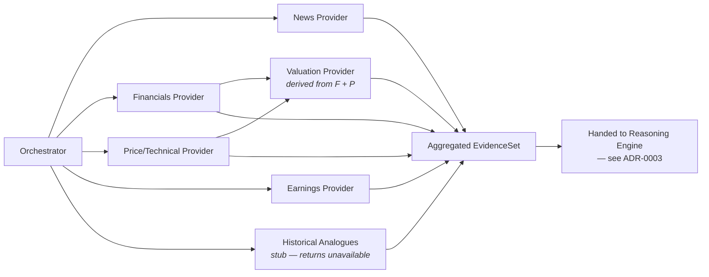

# ADR-0002: Evidence Provider Architecture

|                          |                                                                                                                                                                                           |
| ------------------------ | ----------------------------------------------------------------------------------------------------------------------------------------------------------------------------------------- |
| **Status**         | Proposed                                                                                                                                                                                  |
| **Author**         | CTO / Principal Software Architect                                                                                                                                                        |
| **Date**           | 2026-06-28                                                                                                                                                                                |
| **Inputs**         | `vision.md`, ADR-0001, PRD-0001, Architectural Review (pre-ADR-0002 discussion)                                                                                                         |
| **Amends**         | Supersedes the implicit assumption in ADR-0001 §3.1–3.2 that v1 evidence-gathering reuses the continuous-crawling Ingestion Gateway/Extraction Pipeline design — it does not (see §7) |
| **Depended on by** | ADR-0003 (Reasoning Engine), ADR-0004 (Confidence Calculation), ADR-0005 (Persistence)                                                                                                    |

---

## 1. Purpose & Scope

This ADR defines the architecture of the **Evidence Provider layer**: the deterministic tool layer the Orchestrator calls to execute PRD-0001 §7.2's fixed evidence checklist before any reasoning begins.

**In scope:** the interface contract every evidence category implements, how the six categories are individually treated, execution and caching model, and where this lives in the codebase.

**Explicitly out of scope (deferred to later ADRs or addenda):** the exact confidence-calculation formula (ADR-0004), how the Research/Critic agents consume this evidence during debate (ADR-0003), and specific data-vendor account/contract selection (treated as a lightweight implementation addendum per category, not full ADR weight — see §9).

## 2. Core Principle

Carried forward verbatim from PRD-0001 §6 and §8, and enforced here structurally rather than by convention: **Evidence providers are deterministic components that retrieve or compute verifiable facts. They are incapable of interpretation or recommendation; those responsibilities belong exclusively to the reasoning layer.** They retrieve or compute verifiable facts; they never interpret, opine, or infer. The corollary that drives most of the design below: **if a category cannot be retrieved or computed deterministically and verifiably, the correct behavior is to mark it unavailable — never to approximate it generatively.** This ADR's single most important design decision (§3, Historical Analogues) exists entirely to make that corollary impossible to violate by accident.

## 3. The Six Categories

| Category                       | MVP Status                               | Source type                     | Computation                                                                                                                                                      | Window (default)              |
| ------------------------------ | ---------------------------------------- | ------------------------------- | ---------------------------------------------------------------------------------------------------------------------------------------------------------------- | ----------------------------- |
| Recent news                    | **Active**                         | External news/feed API          | None (retrieval + dedupe)                                                                                                                                        | 90 days                       |
| Financials                     | **Active**                         | Financial data vendor           | None — raw statements + standard derived metrics                                                                                                                | Last 8 quarters               |
| Price / technical              | **Active**                         | Market data vendor              | Deterministic indicator math (SMA/EMA, RSI, MACD, support/resistance)                                                                                            | 2 years                       |
| Earnings                       | **Active**                         | Data vendor / transcript source | None                                                                                                                                                             | Most recent report + guidance |
| Valuation                      | **Active**                         | *Derived* — no external call | Deterministic multiples computation (P/E vs. own history, P/S, EV/EBITDA vs. peers), computed from the Financials and Price providers' already-retrieved results | n/a (derived)                 |
| **Historical analogues** | **Stub — not implemented in MVP** | None                            | None                                                                                                                                                             | n/a                           |

**On Historical Analogues — the adjustment from our last discussion, made explicit here:** this category is *not* a real provider in v1. It is implemented as a fixed stub that, for every request, deterministically returns `status: unavailable` with the reason `"Historical analogue retrieval is deferred — not implemented in this version."` No retrieval is attempted, no vendor is called, and critically, **no LLM inference is permitted to fill this slot.** This is a direct enforcement of the principle in §2: we deliberately chose not to let the Research Agent manufacture analogies in the absence of a curated retrieval system, and the architecture removes the possibility entirely rather than relying on a prompt instruction to prevent it.

The category stays structurally present in the interface (§4) for one reason: when a real Historical Analogue Retrieval architecture is eventually justified, it slots into the same checklist and the same `EvidenceResult` contract without the Orchestrator, the Reasoning Engine, or the report-rendering logic needing to change at all. That future architecture is intentionally **not yet a numbered ADR** — per the same principle that governs adding new reasoning agents, we shouldn't pre-design a curated retrieval system before there's a concrete case for one.

## 4. Interface Contract

Every category — active or stubbed — implements the same contract, because this contract is what defines "evidence completeness" as a structural signal that ADR-0004 will consume later.

```
EvidenceRequest {
    ticker: str
    category: EvidenceCategory   # enum: news | financials | price_technical |
                                  #       earnings | valuation | historical_analogues
    params: dict                 # category-specific (window, depth, etc.)
}

EvidenceResult {
    category: EvidenceCategory
    status: ok | partial | unavailable
    data: <category-specific typed payload> | None
    source_attribution: str | None     # vendor/feed name, for citation (PRD §7.6 #13)
    retrieved_at: datetime
    reason: str | None                  # required when status != ok
}
```

- `ok` — full data retrieved within scope/window.
- `partial` — some data retrieved but with a known gap (e.g., thin analyst coverage, a quarter missing).
- `unavailable` — nothing usable retrieved, or — for Historical Analogues — always, by design.

The Orchestrator never receives anything *other* than one of these three statuses per category. There is no fourth path where a provider silently fabricates a value, which is the direct architectural answer to PRD §7.2's "the system must never fabricate a value for a missing evidence category."

## 5. Execution Model



- **News, Financials, Price/Technical, Earnings, and the Historical Analogues stub** are invoked concurrently (`asyncio.gather`), since they have no dependency on one another. Each call carries its own timeout and a single retry on transient failure; a timeout or vendor error resolves to `status: unavailable` for that category and does **not** abort the rest of the checklist — directly matching PRD §7.2's "the system proceeds with what is available."
- **Valuation** runs after Financials and Price/Technical resolve, since it's a pure computation over their results, not an external call. It is cheap enough that this short sequencing adds negligible latency to the overall checklist phase.
- **Historical Analogues** returns immediately — there's no I/O to wait on.
- The checklist phase is considered *complete*, and reasoning may begin, once every category has returned a status (success or otherwise) — never once "enough" data has arrived by some judgment call. There is no early-exit and no agent-driven decision about whether retrieval is sufficient, per PRD §7.2's requirement that the Research Agent doesn't decide what or when to retrieve.

## 6. Caching

PRD §5 establishes the usage pattern explicitly: repeated, deliberate analysis across many tickers, often revisited. A short-TTL Redis cache keyed on `(ticker, category, params)` avoids redundant vendor calls when the same ticker is re-analyzed shortly after a prior run, without introducing a separate cache-invalidation subsystem:

- **Financials / Earnings** — longer TTL (these change at most quarterly); a same-day re-run should hit cache.
- **News / Price-Technical** — short TTL (minutes to low hours); freshness matters more here.
- **Valuation** — not cached independently; it's cheap to recompute once its inputs are available (cached or fresh).
- **Historical Analogues** — not applicable; the stub has no I/O to cache.

This is intentionally simple — TTL-based expiry, no invalidation events, no cache warming — appropriate for a single-user, on-demand product at this stage.

## 7. Where This Lives

A new top-level module, **`packages/evidence/`**, distinct from ADR-0001's `packages/ingestion` and `packages/extraction`. This is a deliberate correction from the prior review: ADR-0001's ingestion/extraction modules were implicitly shaped for continuous, async, multi-source crawling with raw-document persistence — the right design for the future always-on monitoring entry point, not for this on-demand, synchronous, checklist-driven flow. Forcing v1 through that heavier machinery would be overbuilding; `packages/ingestion`/`packages/extraction` remain reserved for that future scope (see ADR-0006 in the roadmap).

```
packages/evidence/
├── contract.py          # EvidenceRequest / EvidenceResult / status enum
├── orchestrator_hooks.py # the fixed checklist runner the Orchestrator calls
├── news/
├── financials/
├── price_technical/
├── earnings/
├── valuation/            # depends on financials/ + price_technical/ outputs
└── historical_analogues/ # the stub provider
```

Each category subfolder implements a shared `EvidenceProvider` protocol (`fetch(ticker, params) -> EvidenceResult`). Swapping a vendor inside any category later touches only that subfolder.

## 8. Failure & Missing-Data Handling

This ADR's responsibility ends at producing an honest, typed status per category — it does not decide how the Reasoning Engine reacts to `partial`/`unavailable` results (that's ADR-0003), nor how confidence is affected (ADR-0004). What it guarantees:

- A failure in one provider never blocks or corrupts another.
- Every non-`ok` result carries a human-readable `reason`, so the eventual report can disclose the gap explicitly per PRD §7.2 and §7.6's requirement that missing categories be visibly flagged, never silently omitted.
- The Historical Analogues stub guarantees this disclosure is automatic and unconditional for that category in v1 — there is no failure path to handle because there is no live behavior to fail.

## 9. Vendor Selection (Explicitly Not Decided Here)

PRD-0001 §4 and §7.2 deliberately leave specific data vendors out of product scope, and this ADR keeps that decision out of architecture scope too — the `EvidenceProvider` protocol exists specifically so a vendor choice is a cheap, reversible implementation detail, not an architectural commitment. Illustrative (non-binding) candidates worth spiking against during implementation: a financial-data API for Financials/Earnings/Valuation inputs, a market-data API for Price/Technical, and a news API or RSS aggregation for News. None of this needs ADR weight; track it as a short implementation note per provider when it's built.

## 10. Tradeoffs

| Decision                               | Alternative                                                     | Why this choice                                                                                                                               | Cost accepted                                                                                                                                                                                                   |
| -------------------------------------- | --------------------------------------------------------------- | --------------------------------------------------------------------------------------------------------------------------------------------- | --------------------------------------------------------------------------------------------------------------------------------------------------------------------------------------------------------------- |
| Historical Analogues as a hard stub    | Best-effort generative inference with disclaimers               | Removes any path to fabricated analogies, matching the explicit product principle                                                             | The capability is genuinely absent in v1, not just weak                                                                                                                                                         |
| New `packages/evidence/` module      | Reuse ADR-0001's `packages/ingestion`/`packages/extraction` | Matches the actual on-demand/synchronous access pattern instead of forcing it through async-crawling machinery built for a different use case | Some logic (e.g. news retrieval) may eventually be duplicated between this and the future monitoring ingestion module — a known, acceptable consolidation opportunity once ADR-0006 is built, not a flaw today |
| Concurrent provider calls              | Sequential calls                                                | Lower total checklist latency for an on-demand, user-waiting flow                                                                             | Slightly more complex partial-failure handling than a simple sequential loop                                                                                                                                    |
| Differentiated cache TTLs per category | One global TTL                                                  | Matches actual data freshness needs (quarterly financials vs. intraday news)                                                                  | A small amount of extra config surface                                                                                                                                                                          |

## 11. What This ADR Does Not Decide

- The exact confidence formula and how `partial`/`unavailable` statuses are weighted into it — **ADR-0004**.
- How the Research and Critic agents consume `EvidenceResult` objects during debate, and how report sections cite `source_attribution` — **ADR-0003**.
- Concrete vendor accounts/contracts — implementation addendum, not an ADR.
- The future curated Historical Analogue Retrieval architecture — deferred, unnumbered, until there's a concrete case for it.

---

### Closing note

The one rule this entire ADR exists to protect is in §2: a missing category is always disclosed, never invented. Historical Analogues is simply the category where that rule is currently absolute rather than partial — and the interface is built so that stays true even after a real retrieval system eventually replaces the stub.
