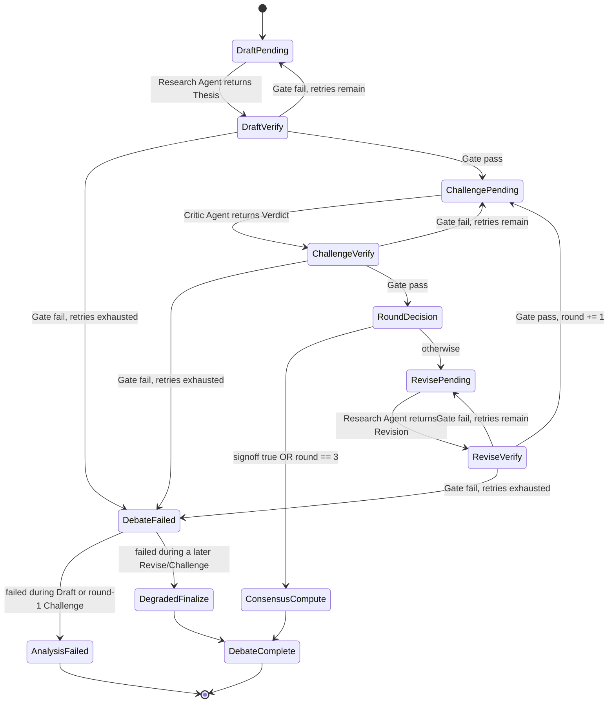

# ADR-0003: Reasoning Engine Architecture

| | |
|---|---|
| **Status** | Proposed |
| **Author** | CTO / Principal Software Architect |
| **Date** | 2026-06-28 |
| **Inputs** | `vision.md`, ADR-0001, ADR-0002 (Evidence Provider Layer), PRD-0001, the frozen MVP system architecture review |
| **Amends** | Formally supersedes ADR-0001 §4 (the five-role agent architecture). The Reasoning Engine has exactly two AI-driven roles — Research Agent and Critic Agent — operating under a deterministic Orchestrator |
| **Depended on by** | ADR-0004 (Confidence Calculation — consumes this ADR's `ConsensusClassification`), ADR-0005 (Persistence — stores this ADR's `DebateTrail`) |

> Terminology note: per our last discussion, this document uses **Evidence Provider Layer** throughout, not "Evidence Provider," to reflect that it is composed of multiple deterministic providers (ADR-0002).

---

## 1. Purpose & Scope

This ADR defines the complete internal architecture of the Reasoning Engine: how the Orchestrator manages the debate from first draft to final consensus, the exact data exchanged between the Research and Critic agents, the deterministic state machine governing that exchange, the structured sign-off mechanism, the Verification Gate's internal architecture, bounded regeneration and terminal failure handling, and how the Report Assembler consumes the result.

**Out of scope:** the exact Confidence Calculation formula (ADR-0004), the Evidence Provider Layer's internals (already settled in ADR-0002), the persistence schema (ADR-0005), and model/provider selection (implementation addendum). This document assumes a complete, gate-passed `EvidenceSet` already exists when the Reasoning Engine begins.

## 2. Governing Principle: The Deterministic/AI Boundary

One rule governs every design decision below, and it is stated explicitly here so nothing downstream has to re-derive it:

> **The Orchestrator never interprets. It only routes structured data and reads structured fields.** Any decision the Orchestrator makes (continue debate vs. stop, pass vs. fail, which section a claim belongs to) must be answerable by reading a typed field — never by parsing or summarizing natural language.

The test for whether a given piece of logic belongs to a deterministic component or an AI-driven one: **if it can be expressed as a pure function over already-validated structured data, it is deterministic; if it requires natural-language understanding to produce its answer, it is AI-driven, and its output must pass through the Verification Gate before anything else is allowed to trust it.** Section 9 applies this test to every component in the Reasoning Engine as a single summary table — but it is the test in this section, not the table, that should govern any new component added later.

## 3. The Debate Lifecycle

The Orchestrator runs the debate as a deterministic, finite-round protocol — plain code, not an LLM-driven loop. One **round** is defined as one Critic Agent verdict cycle. The protocol is hard-capped at **3 rounds** (PRD-0001 §7.4) and can terminate earlier on structured sign-off.

**Phases, in order:**

1. **Draft** — the Research Agent receives the complete `EvidenceSet` (+ optional user question) and produces an initial `Thesis` (round 1, no objections yet to respond to).
2. **Challenge** — the Critic Agent receives the current `Thesis` and the same `EvidenceSet` (read-only — it cannot retrieve anything new) and produces a `CriticVerdict`: a set of `Objection`s plus a structured `signoff` boolean.
3. **Decision** — a pure function reads `signoff` and the round counter. If `signoff == true`, or the round counter has reached 3, the debate ends. Otherwise, continue.
4. **Revise** — the Research Agent receives the `Objection`s and produces a `Revision`: updated claims plus a structured response to each objection. The round counter increments, and control returns to **Challenge**.
5. **Finalize** — once the debate ends, a deterministic function computes the `ConsensusClassification` from the final `CriticVerdict` (§7), and the result is handed to the Confidence Calculator (ADR-0004) and then the Report Assembler (§10).

Every generative step (Draft, Challenge, Revise) passes through the Verification Gate (§8) before the Orchestrator treats its output as real. This is true even for the very first Thesis — nothing generated is trusted by default.

## 4. State Machine



Every transition out of a `*Verify` state is decided by reading a `GateResult.passed` boolean and a retry counter — never by judgment. The only two states where natural-language *content* is produced are `DraftPending`, `ChallengePending`, and `RevisePending` (the agent calls themselves); every other state is a deterministic check or a pure routing decision.

## 5. Message Schemas

These are the exact data contracts exchanged between the Orchestrator and the two agents. They will be implemented as Pydantic models; the field-level architecture is fixed here.

```
EvidenceRef {
    category: EvidenceCategory
    result_id: str
    excerpt: str              # the specific cited portion — required for faithfulness checking
}

Claim {
    id: str
    section: ReportSection     # which of the 17 canonical sections this belongs to
    statement: str
    evidence_refs: list[EvidenceRef]
    directional_lean: buy | hold | avoid | insufficient_evidence | null   # set only on the top-level recommendation claim
}

Thesis {
    task_id: str
    round: int
    claims: list[Claim]
    directional_lean: buy | hold | avoid | insufficient_evidence
}

Objection {
    id: str
    target_claim_id: str
    severity: minor | material
    rationale: str
    counter_evidence_refs: list[EvidenceRef]   # must point into the existing EvidenceSet — no new retrieval
}

CriticVerdict {
    task_id: str
    round: int
    objections: list[Objection]
    signoff: bool               # the structured sign-off field — see §7
}

ObjectionResponse {
    objection_id: str
    action: reinforce | revise | concede
    rationale: str
    new_evidence_refs: list[EvidenceRef] | null   # still drawn only from the existing EvidenceSet
}

Revision {
    task_id: str
    round: int
    updated_claims: list[Claim]      # only claims that changed
    responses: list[ObjectionResponse]
}

DebateRound {
    round: int
    thesis_snapshot: Thesis
    verdict: CriticVerdict
    revision: Revision | null        # null if signoff happened this round
}

DebateTrail {
    task_id: str
    rounds: list[DebateRound]
}

ConsensusClassification {
    status: full | partial | unresolved
    rationale: str                    # produced by the deterministic classification function, §7 — never an LLM
}

GateResult {
    stage: schema | citation_existence | faithfulness
    passed: bool
    reasons: list[str]
    target_id: str                    # the Claim/Objection/Response id that failed, if any
}
```

A `Critic Agent` never sees or produces an `EvidenceRef` that isn't already present in the `EvidenceSet` — the schema has no field through which it could introduce one, which is the structural enforcement of "no new retrieval during debate."

## 6. Structured Sign-off Mechanism

The Critic Agent emits `signoff: bool` as a **required field on every `CriticVerdict`**, produced in the same generative call as the objections themselves. The Orchestrator's decision logic (§4, `RoundDecision`) reads this single boolean — it never parses the `rationale` text of any objection to infer agreement.

**Consistency is enforced structurally, not by trusting the model to be self-consistent:** the Verification Gate's schema check (§8.1) rejects any `CriticVerdict` where `signoff == true` but at least one `objection.severity == material` is present. This is a deterministic rule over two fields already in the schema — if the Critic claims sign-off while still holding a material objection, that response fails schema validation and triggers regeneration (§9), the same as any other malformed output. Minor objections may coexist with `signoff == true`; they don't block consensus, but they are preserved and surface in the report (§10).

## 7. Deterministic Consensus Classification

`ConsensusClassification` is computed by a pure function reading only the **final** `CriticVerdict` of the debate (the one that ended it, whether by sign-off or by hitting the 3-round cap):

| Final verdict state | Classification |
|---|---|
| `signoff == true`, zero objections | **Full** |
| `signoff == true`, only minor objections remain | **Partial** |
| `signoff == false` (debate ended by hitting round 3 with material disagreement unresolved) | **Unresolved** |

No natural-language interpretation occurs anywhere in this function — it is three field reads and a branch. This is the deterministic output the Confidence Calculator (ADR-0004) consumes as one of its inputs.

## 8. Verification Gate Architecture

The Gate is invoked after every generative step (Draft, Challenge, Revise) and once more over the fully assembled report. It runs three distinct checks, two of which are genuinely deterministic and one of which is not — and this ADR states that distinction plainly rather than papering over it.

### 8.1 Schema validation (deterministic)
The output parses into its expected model; required fields are present; enums are valid; field-level consistency rules hold (e.g., the signoff/material-objection rule in §6). Pure parsing and rule-checking — no semantic judgment.

### 8.2 Citation existence (deterministic)
For every `EvidenceRef` in a `Claim`, `Objection`, or `ObjectionResponse`, confirm that `(category, result_id)` actually exists in the task's `EvidenceSet` with `status != unavailable`. This is a lookup against data already retrieved by the Evidence Provider Layer — it catches a fabricated or non-existent source outright, with no judgment involved.

### 8.3 Faithfulness checking — the one acknowledged AI-driven step inside the Gate
Checking that the cited `excerpt` actually *supports* the statement made about it is not a lookup — it requires natural-language understanding. **This ADR does not pretend otherwise.** The resolution:

- A narrowly-scoped **Faithfulness Checker** performs this check, architecturally separated from the Gate's deterministic logic. Its task is deliberately as small as it can be made: given one `(statement, excerpt)` pair, return `supports | contradicts | unrelated` plus a one-sentence reason. It never sees the full thesis, the debate history, or anything beyond the single pair it's asked about — it cannot introduce new information or make a holistic judgment.
- The Faithfulness Checker's own output is itself schema-validated (§8.1) before the Gate trusts it — it must return one of exactly three enum values. **No output in this system reaches the Orchestrator without passing through a deterministic check**, including the output of the one AI-driven step embedded inside the deterministic Gate. This is what keeps the exception from undermining the rule.

**Why an AI-driven checker instead of a deterministic string/embedding-similarity match:** a pure similarity match would reject valid paraphrases (a usability cost) and — more importantly — would accept claims that are keyword-similar but directionally wrong (e.g., matching on "revenue" and "growth" while missing that the excerpt describes a *decline*). Given the vision's core "never fabricate, never silently accept the unsupported" principle, that second failure mode is the one this Gate exists to prevent, and it's worse than the cost of a small, bounded generative step. A future revision could replace this with a fine-tuned classifier once enough labeled faithfulness data exists from production use (ADR-0005's persisted trails are exactly that data) — noted here as a deliberate future option, not a present decision.

### 8.4 Gate pipeline order
Schema validation → citation existence → faithfulness checking → aggregate `GateResult`. A failure at any stage short-circuits the remaining checks for that output (no point faithfulness-checking a citation that doesn't exist).

## 9. Bounded Regeneration & Terminal Failure Paths

**Regeneration:** on any Gate failure for a generative output (Draft, Challenge, or Revise), the Orchestrator requests regeneration from the same agent, passing the specific `GateResult.reasons` back as targeted context — not a bare retry. **Maximum 2 retries per step (3 total attempts).** This cap is small deliberately: it is meant to absorb an occasional model slip, not mask a systemic prompt or model failure behind unbounded retries and runaway latency/cost.

**Terminal failure — the path this architecture previously lacked, now resolved:** exhausting the retry budget transitions to `DebateFailed`, which branches deterministically on *when* the failure occurred:

- **Total failure** (`DraftPending` or the first `ChallengePending` never produced a gate-passed result) → there is no usable, verified material yet. The Orchestrator emits a structured `AnalysisFailed` result — ticker, failure-stage, and reason class — which is persisted (for audit) but explicitly tagged as a failed run, never rendered as a report. The system does not fabricate a verdict from nothing.
- **Partial failure** (the failure occurred during a later `Revise` or `Challenge`, meaning at least one earlier round already produced a fully gate-passed `Thesis`/`CriticVerdict` pair) → the Orchestrator falls back to that last fully gate-passed state, sets `ConsensusClassification.status = unresolved` (the debate didn't complete cleanly, regardless of what the last good verdict's `signoff` said), and proceeds to Confidence Calculation and Report Assembly using that state. The report **must** visibly disclose "debate terminated early in round N due to a verification failure" — this is not optional and not hidden in a log; it is a required field the Report Assembler renders into the Consensus Status section.

This gives the system a graceful-degradation path when there's genuinely usable, verified work already done, while refusing categorically to manufacture a result when there isn't.

## 10. Report Assembler: Consuming the Final Thesis

The Report Assembler is a pure, deterministic transform — confirmed unchanged from our last discussion: the Research Agent's job ends at producing a `Thesis`; the Assembler's job is presentation, not reasoning.

**Input:** the final gate-passed `Thesis`, the complete `DebateTrail`, the `ConsensusClassification`, the `Confidence` output (ADR-0004), and any disclosure flags from §9.

**Process:**
1. Place each `Claim` into its report section using the `Claim.section` field — the Research Agent already decided section placement; the Assembler does no interpretation, only routing.
2. Render the `DebateTrail`'s objections and responses into the visible "Critic objections / Research responses" sections, formatted from the structured `rationale` strings as written — not reworded or summarized further.
3. Inject `ConsensusClassification.status` and the `Confidence` value + rationale into their fixed report fields.
4. For any of the 17 required sections with no corresponding claim (most notably Historical Analogues, per ADR-0002's stub), insert the fixed disclosure text for that section — a section is never left blank and never filled with invented content.
5. If a §9 partial-failure disclosure flag is present, render it into the Consensus Status section.
6. Run the assembled object through the Verification Gate once more — schema and citation-existence only at this stage (faithfulness was already checked per-claim during the debate; re-running it over the whole document would be redundant) — before handing off to Persistence.

**Output:** the canonical Report object. **Communicates with:** the Orchestrator only. **Nature:** deterministic, as established.

## 11. The Deterministic/AI Boundary — Complete Summary

| Component | Nature | Why |
|---|---|---|
| Orchestrator | Deterministic | Pure control flow and routing; never interprets |
| Research Agent | AI-driven | Synthesis and interpretation of evidence |
| Critic Agent | AI-driven | Adversarial judgment |
| Verification Gate — schema check | Deterministic | Structural validation |
| Verification Gate — citation existence | Deterministic | Lookup against the EvidenceSet |
| Verification Gate — faithfulness checker | **AI-driven**, narrowly scoped and itself gated | Requires semantic understanding; cannot be a lookup |
| Consensus classification | Deterministic | Pure function over two fields of the final verdict |
| Confidence Calculator (ADR-0004) | Deterministic | Pure function over structured inputs |
| Report Assembler | Deterministic | Pure transform and template-fill |

Two AI-driven surfaces exist in the entire Reasoning Engine: the two debate agents, and the one bounded faithfulness check embedded inside the Gate. Everything else — including every decision about *whether to continue, retry, fail, or finalize* — is plain, auditable code.

## 12. Tradeoffs

| Decision | Alternative | Why this choice | Cost accepted |
|---|---|---|---|
| Structured `signoff` boolean, Gate-enforced consistency | Infer agreement from the Critic's free-text rationale | Removes the one place this architecture would otherwise require natural-language interpretation by the Orchestrator | Slightly more rigid prompting requirement on the Critic Agent, mitigated by schema validation + regeneration |
| AI-driven Faithfulness Checker, narrowly scoped and self-gated | Pure string/embedding similarity matching | Meaningfully better protection against accepting a keyword-similar but substantively wrong citation — the failure mode the Gate exists to prevent | The Gate is no longer 100% non-generative; one bounded, schema-checked LLM call per citation |
| Two-tier terminal failure (hard fail vs. degraded-finalize, branching on round) | A single uniform policy (always hard-fail, or always degrade) | Never fabricates a result from nothing, while still using verified partial work when it's genuinely safe to | More branching logic in the Orchestrator's failure path than a uniform policy would need |
| Fixed regeneration cap (2 retries) | Unbounded retry-until-success | Bounds latency and cost, and surfaces systemic prompt/model problems as failures instead of masking them | A run can legitimately fail even when a slightly more persistent retry might have eventually succeeded |

## 13. What This ADR Does Not Decide

- The exact Confidence Calculation formula and threshold value — **ADR-0004**, which now has this ADR's `ConsensusClassification` and Gate-history as fixed inputs to build on.
- Concrete persistence schema for `DebateTrail` and `AnalysisFailed` records — **ADR-0005**.
- Model/provider selection for the Research Agent, Critic Agent, and Faithfulness Checker (these could reasonably be three different models given their very different task shapes) — implementation addendum, not architecture.
- Specific prompt content for any agent.

---

### Closing note

The two open items carried into this ADR from the prior review — the Gate's faithfulness-checking mechanism, and the structured sign-off signal — are resolved above, not deferred again. What's left open (§13) is genuinely the next layer down, not unfinished business from this one. This document is what another engineer should be able to build the Reasoning Engine from directly.
