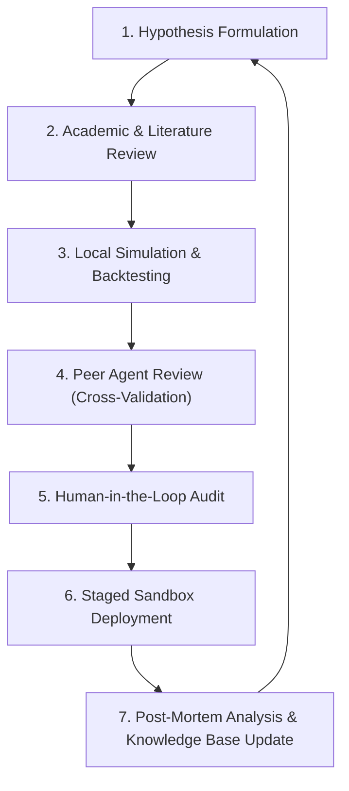

# Veridion: Vision Document

*Founding Constitution & Technical Vision for Autonomous Intelligence*

---

## 1. Vision

**To build the world’s most trustworthy autonomous reasoning platform for complex decision-making.**

## 2. Mission

To engineer an open-source, multi-agent platform that allows researchers and engineers to model, simulate, and analyze complex systems using collaborative reasoning and empirical validation—starting with global financial markets.

## 3. Core Values

* **Truth over confidence:** We prioritize accuracy and evidence over certainty.
* **Evidence over opinion:** Every assertion must be backed by verifiable data.
* **Transparency over black boxes:** The reasoning path behind every decision must be fully auditable.
* **Continuous learning over fixed intelligence:** Our systems must adapt as the world changes, treating failures as telemetry for improvement.
* **Collaboration over isolated reasoning:** No single agent has the full picture; intelligence emerges from structured debate.
* **Long-term thinking over short-term optimization:** We build foundations designed to scale and endure rather than chasing temporary gains.

## 4. First Principles

* **Complex Adaptive Systems:** Markets, economies, and social networks are complex adaptive systems where patterns emerge from the interactions of many independent entities.
* **Bounded Rationality:** No single model or agent can comprehend the entire state of a complex system.
* **Probabilistic Reality:** Decisions in complex systems are inherently probabilistic. We cannot eliminate uncertainty; we can only measure, calibrate, and manage it.
* **Emergent Intelligence:** Intelligent reasoning is not a property of a single model, but an emergent property of collaboration, debate, and continuous empirical feedback.

## 5. Problem Statement

Modern decision-making environments are overwhelmed by noise, fragmented data, and systemic volatility. In these systems, traditional quantitative methods often fail to capture qualitative context, while general-purpose artificial intelligence models suffer from critical vulnerabilities:

* **Lack of Grounding:** Generative models frequently invent facts, numbers, or sources.
* **Opacity:** Neural networks operate as black boxes, making it difficult to audit how a recommendation was reached.
* **Regime Drift:** Static models trained on historical datasets fail when faced with new, unseen system dynamics.

## 6. Why Veridion Exists

Veridion is built to bridge the gap between raw quantitative data processing and high-level qualitative reasoning. While we begin with global financial markets—the most competitive and data-dense complex systems in existence—our underlying architecture is designed to be domain-agnostic.

By combining structured multi-agent collaboration with a research-first engineering process, Veridion translates complex signals into transparent, evidence-based intelligence.

## 7. Core Philosophy

* **Evidence Over Intuition:** Every assertion, analysis, or decision generated by the platform must be directly traceable to primary source data, empirical literature, or validated mathematical proofs.
* **Collaborative Specialization:** Monolithic models are ill-suited for complex reasoning. Veridion utilizes networks of highly specialized, narrow agents (e.g., policy analysts, quantitative validators, forensic accountants) operating under formal consensus protocols.
* **Constructive Disagreement:** Disagreement between independent agents is a feature, not a bug. By assigning agents different perspectives, data sources, or validation criteria, we foster structured debate. Agents must challenge each other's assumptions, expose logical weaknesses, and debate evidence before arriving at a collective consensus.
* **Epistemic Humility:** The platform must explicitly model its own uncertainty. Recognizing the boundaries of what the system does not know is as critical as executing what it does know.

## 8. Guiding Principles

* **Radical Traceability:** Every output must generate a comprehensive execution graph detailing the exact data sources retrieved, the intermediate reasoning steps taken, and the validation checks passed.
* **Sovereignty of Logic:** Qualitative reasoning must be bound by formal rules (e.g., double-entry bookkeeping, regulatory frameworks, accounting standards) that cannot be bypassed by generative inference.
* **Bias Mitigation & Neutrality:** System design must actively identify and mitigate cognitive biases, recency effects, and data-source manipulation.

## 9. Design Principles

* **Human-in-the-Loop Control:** Autonomous agents augment human decision-making; they do not replace it. Humans retain final veto and execution authority over high-consequence actions.
* **Traceable Evidence:** Every conclusion, report, or signal generated by an agent must explicitly cite its underlying data sources, literature, or mathematical models.
* **Calibrated Uncertainty:** Recommendations must never be presented as absolute facts. They must be accompanied by explicit confidence intervals, probabilistic bounds, or qualitative uncertainty ratings.
* **Systematic Backtestability:** Any predictive model or decision heuristic must be structured such that it can be historically backtested against out-of-sample data whenever feasible.
* **Single-Responsibility Agents:** Each AI agent within the network has a tightly bounded role (e.g., parsing a specific document type or validating numerical calculations) to ensure auditability and reduce cognitive drift.
* **Adversarial Validation:** Before any synthesized recommendation is finalized, independent critic or validator agents must challenge the primary agent's assumptions, exposing logical gaps or biases.
* **Blameless Failure Loops:** System errors, incorrect predictions, and agent failures must be treated as telemetry. Every failure must produce a structured post-mortem that directly informs future agent prompt engineering, constraints, or knowledge base updates.

## 10. Long-Term Goals (5–10 Years)

* **Standardization:** Establish Veridion as a widely adopted open-source framework for autonomous economic research and financial modeling.
* **Global Macro Mapping:** Build a real-time, multi-agent simulation of global supply chains, regulatory changes, and macroeconomic flows to identify systemic risks.
* **Neuro-Symbolic Maturity:** Achieve a fully integrated neuro-symbolic architecture where LLMs handle natural language synthesis and qualitative parsing, while symbolic logic engines enforce mathematical and structural constraints.
* **Hallucination Containment:** Establish automated validation pipelines that systematically detect, isolate, and flag factual anomalies in real-time.

## 11. What Veridion Is

* **A Cognitive Architecture:** A modular software system designed to orchestrate agent workflows, memory systems, and tool usage specifically for financial domains.
* **A Research Platform:** An environment where economists and engineers can write, test, and run simulations on autonomous agents.
* **An Explainability Layer:** A suite of tools designed to translate complex model outputs into human-readable, auditable reasoning paths.
* **A Decision-Support Engine:** A highly reliable partner for human analysts, providing deep-dive research and hypothesis testing.

## 12. What Veridion Is NOT

* **An Ideological Sandbox:** Veridion does not favor any single financial methodology over another. Whether analyzing macroeconomic indicators, corporate fundamentals, quantitative order flows, sentiment, or technical price action, the platform remains methodology-agnostic. The sole requirement is that any approach must be empirically testable and validated by evidence.
* **A Black-Box Predictive Oracle:** We do not claim to forecast markets with absolute certainty. The platform is designed to assess probabilities, map scenarios, and evaluate risks, not to act as a guaranteed predictive engine.
* **A Generic LLM Wrapper:** Veridion is an engineering framework that treats LLMs as raw cognitive components, surrounding them with deterministic pipelines, databases, and verification engines.

## 13. Success Metrics

To evaluate the efficacy of the Veridion platform, we track four primary dimensions:

* **Traceability Index ($T_i$):** The percentage of agent assertions that are successfully mapped to a verifiable, primary data source (Target: >99.0%).
* **Consensus Efficiency:** The time, computational overhead, and accuracy of multi-agent negotiation protocols when resolving conflicting economic hypotheses.
* **Factual Precision:** The rate of factual anomalies or mathematical errors detected in agent-generated reports during automated regression testing, aiming to continuously minimize errors through automated verification gates.
* **Hypothesis Replication Rate:** The percentage of agent-proposed economic relationships that hold true when subjected to out-of-sample historical backtesting.

## 14. Engineering Principles

* **Deterministic Replayability:** Given the same inputs, external data snapshots, and random seeds, any agent simulation or reasoning path must be reproducible.
* **Strict Decoupling:** Ingestion, cognition, validation, and action layers must remain strictly isolated. Cognitive agents must never have direct, unmediated write access to external environments.
* **Type Safety & Schema Enforcements:** All internal data exchange between agents must use strictly typed schemas (e.g., Protocol Buffers, Pydantic) to prevent structural failures.
* **Defense in Depth:** Agent execution environments must be sandboxed to prevent arbitrary code execution or unauthorized network access.

## 15. AI Principles

* **Gated Inference:** All generative outputs must pass through automated, non-generative verification gates (e.g., parser checks, mathematical validation, cross-referencing).
* **Confidence Calibration:** Agents must output a calibrated confidence score alongside every conclusion. If confidence falls below a defined threshold, the agent must flag the task for human intervention.
* **Separation of Concerns:** Keep retrieval (finding facts) strictly separated from synthesis (writing the response) to minimize context contamination and hallucination.

## 16. Research-First Development Process

Every feature, agent capability, or analytical module introduced to Veridion must undergo a structured pipeline:

1. **Hypothesis Formulation:** Define the specific economic or financial reasoning capability required.
2. **Academic & Literature Review:** Verify the theoretical soundness of the approach using established economic models.
3. **Local Simulation & Backtesting:** Run the agent network against historical data or synthetic scenarios.
4. **Peer Agent Review:** Use secondary validation agents to challenge the primary agent's assumptions and identify logical fallacies.
5. **Human-in-the-Loop Audit:** Expose the reasoning logs to domain experts for review.
6. **Staged Sandbox Deployment:** Deploy the capability to isolated environments with strict resource constraints.
7. **Post-Mortem Analysis:** Document failures, update the [knowledge-base](file:///Users/krrishbiswas/Desktop/Veridion/research/knowledge-base), and refine the agent templates.

## 17. Future Vision

We envision a world where financial markets and economic policies are guided not by speculative noise, but by clear, verifiable, and democratized intelligence. By open-sourcing the core cognitive architecture of Veridion, we aim to empower researchers, institutions, and individuals with the tools necessary to understand systemic complexity, mitigate tail-risk events, and build a more stable, transparent global economy.
